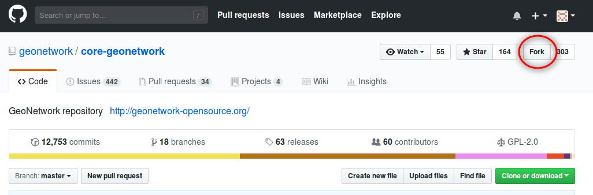
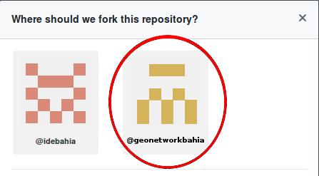
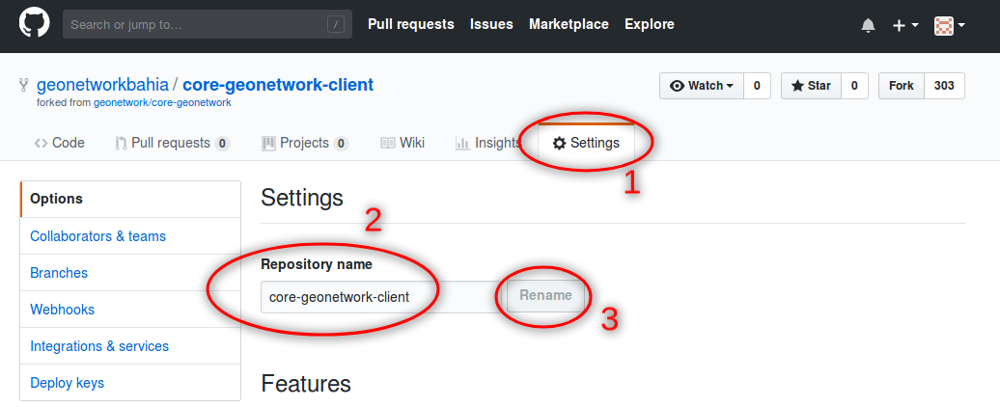

# <a name="Topo"></a>Manual de Atualização do Geonetwork

Manual descritivo dos passos realizados no processo de atualização do **Geonetwork**.

<br>

## SUMÁRIO

<!-- MarkdownTOC levels="1,2,3,4,5" -->


 [HISTÓRICO DE REVISÕES](#histÓrico-de-revisÕes)

 [1. INTRODUÇÃO](#1-introduÇÃo)

 [2. CRIAÇÃO DO FORK](#2-criaÇÃo-do-fork)

 [3. CLONANDO E ATUALIZANDO O REPOSITÓRIO DO GITHUB](#3-clonando-e-atualizando-o-repositÓrio-do-github)

<!-- /MarkdownTOC -->

<br>

[[TOPO]](#Topo)

## HISTÓRICO DE REVISÕES

| Data       | Versão | Descrição                              | Autor                                     |
| ---------- | ------ | -------------------------------------- | ----------------------------------------- |
| 19/07/2018 | 0.1    | Criação do documento                   | [Marcelo Gomes Santana](@MarceloGSantana) |
| 01/08/2018 | 0.2    | Atualização da Introdução e do item 3. | [Marcelo Gomes Santana](@MarceloGSantana) |

<br>

[[TOPO]](#Topo)

## 1. INTRODUÇÃO

Para auxiliar a implementação das mudanças necessárias no Geonetwork foram descritos neste documento os passos para a criação do *fork* inicial do repositório original no GitHUB, bem como, a clonagem do repositório *forked* remoto do GitHUB para uma máquina local.

<br>

[[TOPO]](#Topo)

## 2. CRIAÇÃO DO FORK

Para criar um *fork* do repósitório oficial do **Geonetwork** no **GitHUB**, deve-se executar os seguintes passos:

1. Faça o login no **GitHUB** com o usuário **idebahia**;
2. A partir do usuário **idebahia** no **GitHUB**, acesse o repositorio oficial do **Geonetwork** no endereço [https://github.com/geonetwork/core-geonetwork](https://github.com/geonetwork/core-geonetwork);
3. Na tela principal do repositório, clique no botão **Fork** próximo ao canto superior direito da página.
   
4. Como o usuário **idebahia** é um membro da organização **geonetworkbahia**, será exibido um *popup* para escolher o usuário para o qual o *fork* será feito. Escolha o ícone que representa o **geonetworkbahia**.
   
5. Nó repositório *forked* **geonetworkbahia/core-geonetwork**, acesse a aba **Settings** (1), altere o **Repository name** de `core-geonetwork` para `core-geonetwork-client` (2) e clique no botão **Rename** (3).
   
6. Ainda na aba **Settings**, acesse o menu **Collaborators & teams** e adicione os usuários do **GitHUB** que serão colaboradores no desenvolvimento do **geonetworkbahia/core-geonetwork-client**;
7. Para poder clonar o repositório numa máquina local, deve-se cadastrar uma chave de desenvolvimento. Para isso, siga os passos abaixo:
   1. Em uma máquina linux (Ubuntu, Mint, etc.), abra um terminal e digite o comando `ssh-keygen` e tecle **Enter**, depois **Enter** novamente.  Forneça a senha ou tecle **Enter** para senha em branco;
   2. Digite o comando `cat ~/.ssh/id_rsa.pub`, tecle **Enter** e copie o resultado do comando no terminal;
   3. No navegador, vá para a aba **Settings** do repositório do **geonetworkbahia/core-geonetwork-client**, acesse o menu **Deploy keys** e clique no botão **Add deploy key**;
   4. Insira um título para a nova chave e cole o conteúdo copiado no passo anterior no campo **Key**;
   5. Marque a opção **Allow write access** para permitir que o colaborador possa enviar os códigos modificados da máquina local para o repositório (fazer um *push* para o repositório) e clique em **Add key**.

<br>

[[TOPO]](#Topo)

## 3. CLONANDO E ATUALIZANDO O REPOSITÓRIO DO GITHUB

**a)** Para clonar o repositório do **geonetworkbahia/core-geonetwork-client** para a máquina local, abra um terminal linux e execute os seguintes comandos:

```bash
git clone git@github.com:geonetworkbahia/core-geonetwork-client.git
cd core-geonetwork-client
git remote add upstream git@github.com:geonetworkbahia/core-geonetwork-client.git
```

**b)** Para atualizar o repositório local com os códigos do repositório **geonetworkbahia/core-geonetwork-client** execute o segunte comando na pasta raiz do repositório local através de um terminal:

```bash
git pull origin master
```

**c)** Para atualizar o repositório **geonetworkbahia/core-geonetwork-client** com os códigos mais recentes do repositório oficial do Geonetwork ([https://github.com/geonetwork/core-geonetwork](https://github.com/geonetwork/core-geonetwork)), abra um terminal e execute os seguintes comandos na pasta raiz do repositório local:

```bash
git fetch upstream
git rebase upstream/master master
```

* Se ocorrerem conflitos entre o código customizado com os códigos do repositório oficial do Geonetwork, corrija-os em todos os arquivos indicados como conflitantes. Após a finalização de todas as correções dos conflitos, execute:

```bash
git add .
git commit -m "Comentário sobre as modificações feitas nas correções dos conflitos."
git push origin master
```

* Caso não ocorra nenhum conflito, execute:

```bash
git push origin master
```

**d)** Para customizar os códigos com as devidas modificações necessárias, faça:

* Primeiramente, atualize o repositório local conforme indicado no subitem **(b)**; 
* Depois, implemente as devidas modificações no código do repositório local;
* Ao final das modificações, execute os seguintes comandos para enviá-las para o repositório:

```bash
git add .
git commit -m "Comentário sobre as modificações feitas."
git push origin master
```


